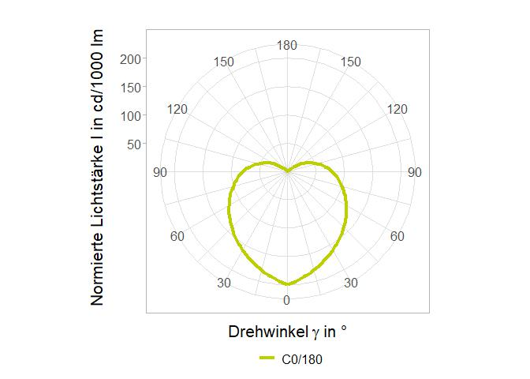

<!-- README.md is generated from README.Rmd. Please edit that file -->

# lighting

<!-- badges: start -->
<!-- badges: end -->

The goal of lighting is to provide some tools to manipulate data, which
are used in the lighting industry. These tools can be categorised into:

- light distribution
- light spectrum and lighting quantities (under development)

## Installation

You can install the development version of lighting from
[GitHub](https://github.com/Wei-Lim/lighting/) with:

``` r
# install.packages("devtools")
devtools::install_github("Wei-Lim/lighting")
```

## Examples

### Read LDT file

Reads LDT into a specific light distribution list. For list items
definitions see `?ld_data`.

``` r
library(lighting)

# typical ldt-file (min. example)
file <- system.file('extdata', "ldt_min_example.ldt", package = "lighting")

# specific light distribution
ld_list <- read_ldt(file)

ld_list
#> $filepath
#> [1] "C:/Users/wt/AppData/Local/Programs/R/R-4.2.1/library/lighting/extdata/ldt_min_example.ldt"
#> 
#> $file_name
#> [1] "ldt_min_example"
#> 
#> $company
#> [1] "company name"
#> 
#> $Ityp
#> [1] "1"
#> 
#> $Isym
#> [1] "1"
#> 
#> $Mc
#> [1] 4
#> 
#> $Dc
#> [1] 90
#> 
#> $Ng
#> [1] 5
#> 
#> $Dg
#> [1] 45
#> 
#> $report_no
#> [1] "measurement no"
#> 
#> $luminaire_name
#> [1] "light distribution minimal example"
#> 
#> $luminaire_no
#> [1] "luminaire no"
#> 
#> $file_name_ldt
#> [1] "filename"
#> 
#> $date_user
#> [1] "17.02.2023, William Truong"
#> 
#> $length
#> [1] 500
#> 
#> $width
#> [1] 0
#> 
#> $height
#> [1] 30
#> 
#> $length_lum
#> [1] 450
#> 
#> $width_lum
#> [1] 0
#> 
#> $height_lum_C0
#> [1] 0
#> 
#> $height_lum_C90
#> [1] 0
#> 
#> $height_lum_C180
#> [1] 0
#> 
#> $height_lum_C270
#> [1] 0
#> 
#> $DFF
#> [1] 90
#> 
#> $LORL
#> [1] 100
#> 
#> $cf
#> [1] 1
#> 
#> $tilt
#> [1] 0
#> 
#> $lamp_standard_sets_no
#> [1] 1
#> 
#> $lamp_no
#> [1] 1
#> 
#> $lamp_type
#> [1] "example lightsource"
#> 
#> $lum_flux
#> [1] 2000
#> 
#> $cct
#> [1] "4000K"
#> 
#> $cri
#> [1] "80"
#> 
#> $power
#> [1] 15
#> 
#> $DR
#>  [1] 0.26 0.36 0.43 0.52 0.58 0.66 0.72 0.77 0.81 0.85
#> 
#> $angleC
#> [1]   0  90 180 270
#> 
#> $angleG
#> [1]   0  45  90 135 180
#> 
#> $lum_int_tbl
#> # A tibble: 5 × 2
#>   gamma    C0
#>   <dbl> <dbl>
#> 1     0   200
#> 2    45   140
#> 3    90    80
#> 4   135     2
#> 5   180     1
#> 
#> $lum_int_extended_tbl
#> # A tibble: 5 × 3
#>   gamma    C0  C180
#>   <dbl> <dbl> <dbl>
#> 1     0   200   200
#> 2    45   140   140
#> 3    90    80    80
#> 4   135     2     2
#> 5   180     1     1
#> 
#> $test_lab
#> [1] "-"
#> 
#> $photometry_type
#> [1] "1"
#> 
#> $ballast_factor
#> [1] 1
#> 
#> $plot
#> [1] NA
```

### Plot light distribution (polar chart)

Plots a typical light distribution data.
<p>

``` r
plot_light_distribution(ld_list$lum_int_extended_tbl)
```


</p>

### Write LDT, convert to IES and export to SVG

``` r
# Write LDT 
ld_write_ldt(ld_list)

# Write IES
ld_write_ies_lm63_2002(ld_list)

# Write SVG          
ld_write_svg(ld_list)            
```
